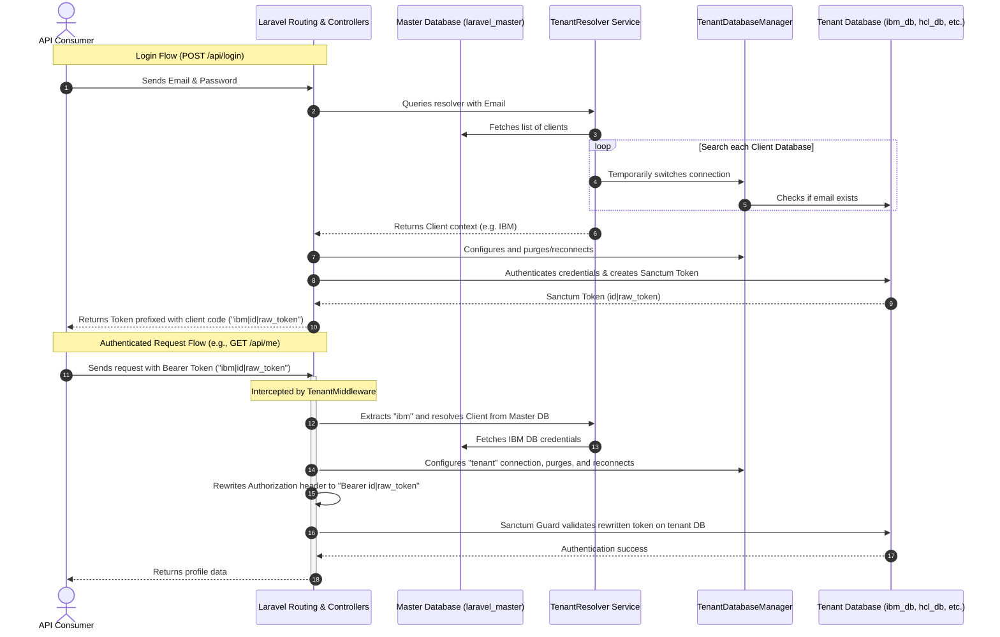

# Laravel 13 Multi-Tenant API Authentication (Database-Per-Tenant)

This repository implements a **Database-Per-Tenant** multi-tenant REST API authentication system using **Laravel 13**, **PHP 8.3+**, and **MySQL**. 

### 💡 The Use Case & Purpose
In B2B SaaS applications (e.g., enterprise CRM, HR portals, B2B procurement systems), clients (like IBM, HCL, or Infosys) often demand strict data isolation due to security compliance, privacy regulations, or audit requirements. A shared database where tenant data is separated only by a `tenant_id` column (single-database multi-tenancy) is often not secure enough for enterprise customers.

This project solves that by provisioning a **completely separate database for each tenant**. All tenants share the same API code/deployment, but their data (including users and access tokens) is kept in isolated databases.

### 🚀 Why This is Beneficial
1. **Complete Data Segregation**: Tenant databases store both user profiles and authentication tokens (`personal_access_tokens` table), ensuring even tokens are segregated per database. A query leak or security vulnerability in one tenant's context cannot expose another tenant's data.
2. **Easy Backups & Restores**: You can backup, migrate, or restore a single client's database without touching or interrupting other customers.
3. **No Domain/Subdomain Overhead**: Instead of forcing tenants to use different subdomains (which complicates DNS, SSL, and frontend routing), this setup routes requests dynamically using **prefixed Sanctum tokens** (e.g., `ibm|1|abcdef...`). The system resolves the tenant, connects to their database, and authenticates the user all on a single unified API domain.

---

## Architecture Overview



### Key Architectural Concepts
1. **Master Database**: Stores a `clients` registry containing database server addresses, ports, names, users, and passwords.
2. **Tenant Databases**: Each tenant owns an independent database containing tables for `users` and `personal_access_tokens` (Sanctum). This provides complete tenant isolation.
3. **Prefixed Sanctum Tokens**: 
   - Because HTTP requests to `/api/me` or `/api/logout` do not contain a tenant indicator (like a subdomain or header) other than the Bearer Token, the token returned on login is prefixed with the client's code (e.g. `ibm|1|abcdef...`).
   - The global `TenantMiddleware` intercepts the request, extracts the prefix (`ibm`), resolves the DB credentials from the master database, switches the default database connection to the tenant database, and rewrites the `Authorization` header to the raw token (`1|abcdef...`).
   - Sanctum then validates the token against the active tenant's database connection.

---

## Project Structure

The multi-tenant logic is designed according to clean architecture, SOLID principles, and separation of concerns:

```
app/
├── Http/
│   ├── Controllers/Api/
│   │   └── LoginController.php     # REST endpoints for login, profile (me), and logout
│   ├── Middleware/
│   │   └── TenantMiddleware.php    # Resolves tenant and switches DB connections for auth routes
│   ├── Requests/
│   │   └── LoginRequest.php        # Form request validation
│   └── Resources/
│       └── UserResource.php        # API resource formatting for User models
├── Models/
│   ├── Client.php                  # Model bound to the 'landing' (master) connection
│   └── User.php                    # Model bound to the 'tenant' (dynamic) connection
└── Services/
    ├── AuthenticationService.php   # Authenticates user and generates prefixed tokens
    ├── TenantDatabaseManager.php   # Performs Config::set, DB::purge, and DB::reconnect at runtime
    └── TenantResolver.php          # Resolves tenants by client code or email scanning
database/
├── migrations/                     # Migrations for master DB (clients, jobs, cache tables)
└── migrations/tenant/              # Migrations run dynamically on tenant databases (users, tokens)
```

---

## Setup & Installation

### Prerequisites
- PHP 8.3+
- MySQL Server
- Composer

### 1. Clone & Install Dependencies
```bash
composer install
```

### 2. Configure Environment
Copy the example environment file and update it with your MySQL server credentials:
```bash
cp .env.example .env
```
Ensure your `.env` contains the following database configuration:
```env
DB_CONNECTION=landing
DB_HOST=127.0.0.1
DB_PORT=3306
DB_DATABASE=laravel_master
DB_USERNAME=root
DB_PASSWORD=
```
*Note: We use `landing` as the default connection for the master database.*

### 3. Create Databases
Ensure the master and tenant databases exist in MySQL. You can create them using the command line or any database GUI:
```sql
CREATE DATABASE IF NOT EXISTS laravel_master;
CREATE DATABASE IF NOT EXISTS ibm_db;
CREATE DATABASE IF NOT EXISTS hcl_db;
CREATE DATABASE IF NOT EXISTS infosys_db;
```

### 4. Run Migrations & Seeders
This single command migrates the master database, seeds the clients, dynamically runs the tenant-specific migrations, and seeds the tenant users:
```bash
php artisan migrate
php artisan db:seed
```

---

## API Documentation

### 1. User Login
- **Endpoint**: `POST /api/login`
- **Headers**:
  - `Content-Type: application/json`
  - `Accept: application/json`
- **Request Body**:
```json
{
    "email": "ibmuser@gmail.com",
    "password": "password"
}
```

- **Successful Response (200 OK)**:
```json
{
    "status": true,
    "client": "IBM",
    "token": "ibm|1|oM4lK...",
    "user": {
        "id": 1,
        "name": "IBM User",
        "email": "ibmuser@gmail.com",
        "created_at": "2026-07-06T18:17:34.000000Z",
        "updated_at": "2026-07-06T18:17:34.000000Z"
    }
}
```

- **Failure Response (401 Unauthorized)**:
```json
{
    "status": false,
    "message": "Invalid credentials"
}
```

### 2. Get Profile (Authenticated)
- **Endpoint**: `GET /api/me`
- **Headers**:
  - `Accept: application/json`
  - `Authorization: Bearer ibm|1|oM4lK...`

- **Response (200 OK)**:
```json
{
    "status": true,
    "user": {
        "id": 1,
        "name": "IBM User",
        "email": "ibmuser@gmail.com",
        "created_at": "2026-07-06T18:17:34.000000Z",
        "updated_at": "2026-07-06T18:17:34.000000Z"
    }
}
```

### 3. Logout (Authenticated)
- **Endpoint**: `POST /api/logout`
- **Headers**:
  - `Accept: application/json`
  - `Authorization: Bearer ibm|1|oM4lK...`

- **Response (200 OK)**:
```json
{
    "status": true,
    "message": "Logged out successfully"
}
```

---

## Testing

### Running Tests
The project features a comprehensive test suite in [TenantAuthTest.php](file:///c:/laragon/www/laravel-multi-tenant/tests/Feature/TenantAuthTest.php) validating authentication, routing, and database switching:
```bash
php artisan test
```

---

## Security Considerations

1. **Shared-Nothing Database Architecture**: Each client has a dedicated database, isolating customer data completely. No cross-tenant queries are possible.
2. **Database Isolation**: Tenant databases store both user profiles and authentication tokens (`personal_access_tokens` table), ensuring even tokens are segregated per database.
3. **Credential Security**: All tenant database credentials in the master database (`clients` table) must be encrypted in production.
4. **Input Validation**: Strict Form Requests (`LoginRequest`) validate input parameters to prevent SQL injection and invalid payloads.
5. **Token Prefixing Validation**: The middleware checks that tokens are well-formed before dynamically matching client codes, and rejects invalid structures immediately.
